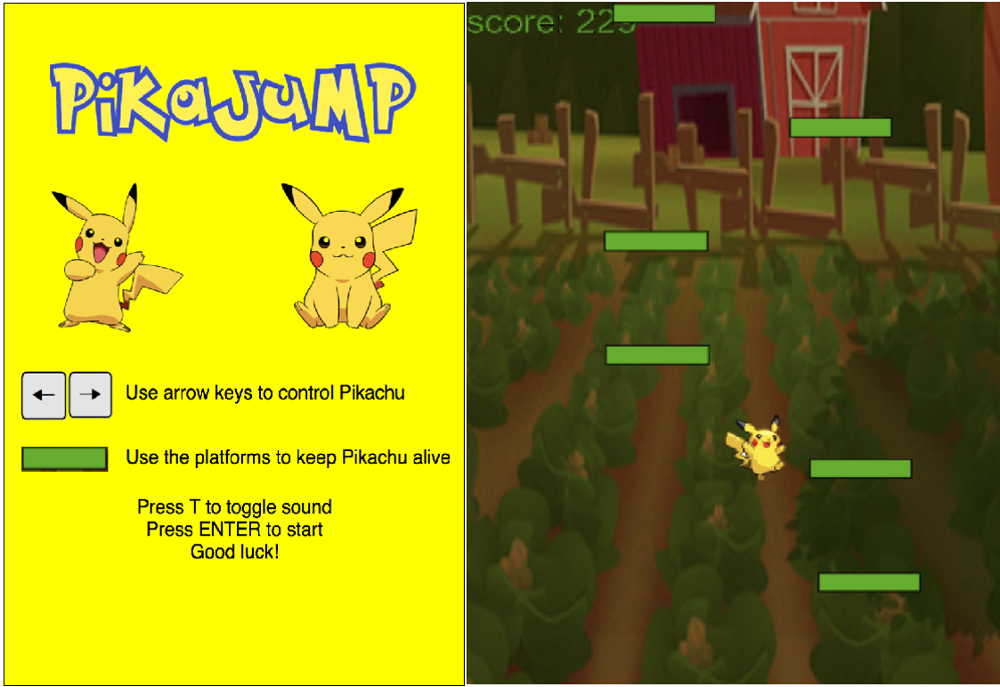

# PikaJump

[Live Demo](https://parkjphilip.github.io/pikaJump)




### Background

PikaJump is an endless platform jumping game inspired by DoodleJump. It was developed in JavaScript and uses HTML5 Canvas for smooth 2D rendering.

### How To Play
Control Pikachu and stay alive by jumping from platform to platform while avoiding enemy Pokemon. Use the left and right arrows keys to move side to side. Press 'T' to toggle the background music.

### Game Features

#### Scrolling Background

A scrolling background was created using the drawImage function from HTML5 Canvas. Platforms are endlessly rendered and made to seem like they are falling by repositioning them with a set displacement at every iteration of the game loop. If a platform falls out of range of the canvas, it is re-rendered at the top to be seen as a new platform.

```javascript
  updatePlatform() {
    this.y += this.vy;
    if (this.y > canvasHeight) {
      this.x = Math.random() * 325;
      this.y = this.y - canvasHeight;
    }
    this.drawPlatform();
  }

  drawPlatform() {
    this.ctx.beginPath();
    this.ctx.rect(this.x, this.y, platformWidth, platformHeight);
    this.ctx.fillStyle = normalPlatformColor;
    this.ctx.fillRect(this.x, this.y, platformWidth, platformHeight);
    this.ctx.stroke();
    this.ctx.closePath();
  }
```

#### Audio / Music Toggling

Sound effects and music toggling were controlled with JavaScript's HTML5AudioElement Web API. Audio files were imported as mp3 and wav files. Music toggling was enabled through the API functions `pause` and `play`.

```javascript
const pokemonThemeSong = new Audio('./assets/sounds/pokemon-theme.mp3');

  toggleSound() {
    if (this.songIsPlaying) {
      this.songIsPlaying = false;
      pokemonThemeSong.pause();
    } else {
      this.songIsPlaying = true;
      pokemonThemeSong.play();
    }
  }
```
